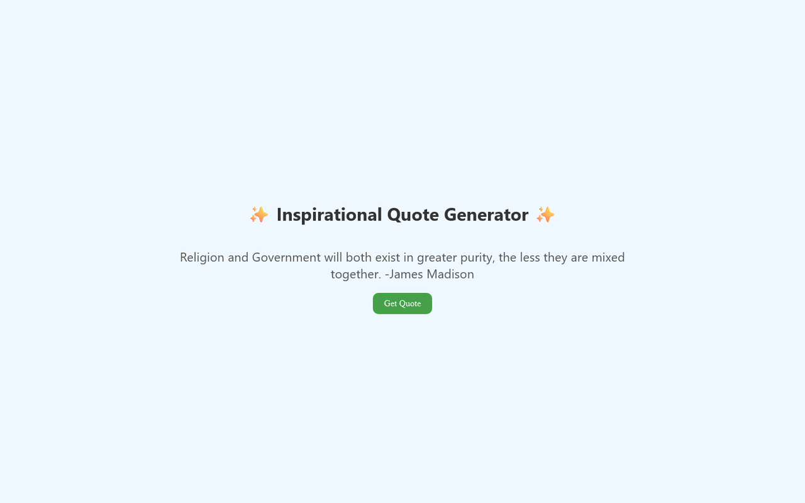

# Inspirational Quote Generator

A simple one-button page that serves up a random quote from Timothy's personal favorites — Ted Lasso, C.S. Lewis, Helen Keller, Dr. Seuss, movies, and plenty more.

**[▶ Open the live app](https://timothyhadfield.github.io/inspirational-quote-generator/)** · works on phone and laptop

  
  &nbsp;
  

## Features
- **Hand-picked collection** — 53 quotes Timothy chose himself, from philosophers and presidents to Ted Lasso and Captain Jack Sparrow
- **No repeats** — every quote shows once before the list starts over
- **One tap** — press *Get Quote* for the next one; nothing to sign up for or install
- **Phone friendly** — centered layout that reads well on a small screen

## Built with
Plain HTML, CSS and JavaScript, hosted on GitHub Pages.
